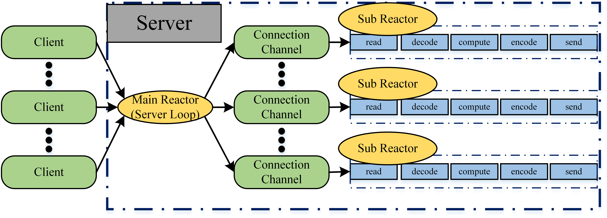
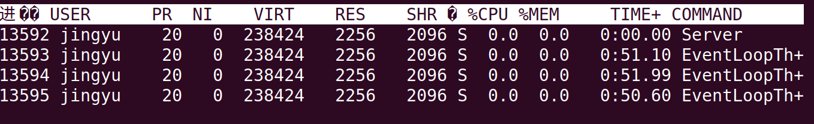
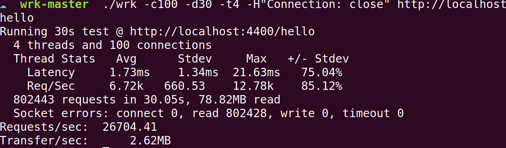
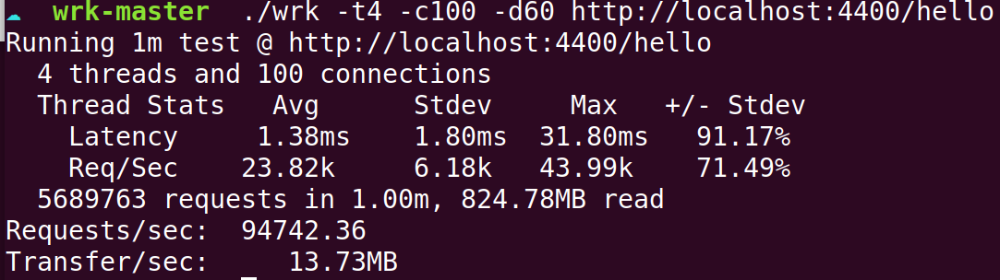
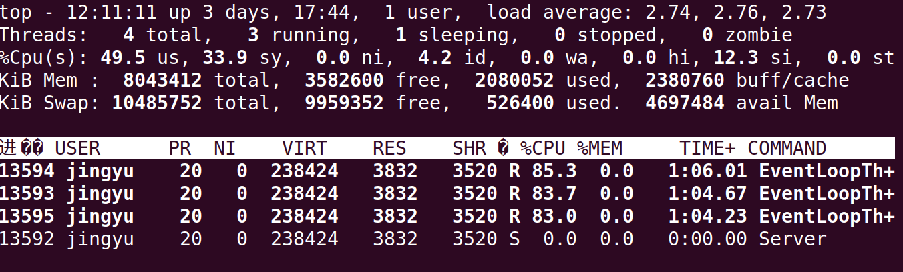

# 版本
每形成一个阶段性版本就在此进行一下总结，回顾一下整体架构，思考未来改进的方向

## 0.1
看了muduo，同时参考了网上其他人写的，根据自己的理解，以及muduo源码，编写了一个web服务器，服务器基于Reactor模式，解析了get/head等请求，支持http长短链接，基于红黑树实现了定时器的有效管理，并且实现了基于双缓冲区的异步日志，时刻记录服务器的运行状态。

整体框架如图，主reactor负责接收新的连接，建立连接后分配给某个SubReactor。跨线程调用利用回调函数队列实现，需要加锁，锁的竞争只在MainReactor和某一SubReactor之间，不同SubReactor之间没有联系。

### Key Points
* 使用epoll水平触发+非阻塞IO，使用Reactor模式
* 采用one loop per thread结构，使用多线程充分利用多核CPU，并使用线程池避免创建销毁的开销
* 使用eventfd实现了线程的异步唤醒
* 使用基于multimap的定时器，主要用于HTTP超时关闭，使用timerfd唤醒等待线程
* 使用双缓冲技术，实现了简单的异步日志
* 使用了RAII技术设计了多个类
* 解析了HTTP请求(GET HEAD)，支持长短连接

### 各个部分介绍：

1. Reactor模式结构(EventLoop, Channel, Epoll)

   采用Reactor模式，事件循环在EventLoop中，并且保证一个线程只有一个EventLoop，使用Epoll等待多个事件，并通过Channel进行注册事件。在从Epoll中唤醒后，分发给各个Channel的handler回调进行处理。同时，通过runInLoop和queueInLoop函数，利用eventfd，实现了跨线程调用。

   * Reactor和Proactor

     Reactor等待感兴趣请求到来，再同步处理事件，Proactor则是通过调用异步IO，调用完立即返回，异步操作将完成结构放入事件完成队列，再依次调用完成事件回调函数。

     由于采用异步IO，Proactor模式会更高效一些，但是由于需要操作系统的支持，但是Linux下的AIO并不完善，所以采用Reactor模式为服务器的模式。

   * select, poll和epoll

     * select 需要把fd集合拷贝到内核态，在fd大时开销大，并且每次都需要遍历所以fd，开销同样很大，此外select最大支持描述符限制在默认为1024，并且select由于输入输出合在一起，每次都需要重新初始化。

     * poll和select类似，但是采用的是pollfd对感兴趣的进行检测，没有select中描述符个数的限制问题。但是同样每次都需要拷贝到内核态，并且结束后需要遍历pollfd数组来找寻。

     * epoll通过添加一个epoll_ctl来更改描述符，使得更改fd时，才会进行更改，因此避免了大量的fds拷贝到用户态的问题。对于返回活跃fds的列表，通过mmap来避免拷贝，并且epoll通过红黑树来进行快速的增删改fds集合操作。

       综上，出于效率上的考虑，采用epoll作为IO服用的模式。同时，epoll提供了ET和LT两种模式，由于ET模式触发方式的原因，每次读必须读到不能读(EAGAIN)，写也一样，这导致编程逻辑更为复杂(性能差不多？没验证过)，因此采用LT模式。

   * 跨线程调用

     学习muduo，利用了runInLoop和queueInLoop，如果属于当前loop，则会直接调用，否则，加入队列后wakeup唤醒属于的loop(已经在调用回调列表时一定要唤醒，因为新添加的在这次不会被执行，因此需要wakeup，防止不被调用)

     对于唤醒方式:

     * pipe通过epoll监听读事件，在其他线程需要唤醒时，往里写一个字节，达到唤醒的目的。
     * eventfd可以通过创建一个文件描述符，当计数值大于0时，fd可读，达到唤醒的目的。

     eventfd只需要一个文件描述符，而且eventfd是一个内核中的8个字节的计数器，而pipe有着缓冲区维护的成本，因此选用eventfd作为唤醒手段。

2. 定时器(Timer)

   TimerManager类需要选择合适的结构进行组织未到期的timer，并且能够快速的找到timer，一般有几种方式：

   - 使用按到期时间排序的线性表

     一般采用线性查找，复杂度为O(N)

   - 使用堆进行组织

     插入等常用操作降为O(logN)，但是priority_queue删除某一timer不方便，可以将其设置为delte标志跳过运行超时

   - 使用map(红黑树)

     复杂度仍为O(logN)，但是使用到期时间作为key，如果遇到同样的到期时间的话，会产生冲突，可以通过使用multimap或者区分key解决

   采用堆方式，不方便实时删除，会导致持有的timer被推迟释放，由于链接的超时回调延长了Connection类的生命周期，导致Connection类被推迟释放，造成不必要的内存占用。因此，采用multimap进行定时器的管理，可以使删除和插入均有较好的性能。
   TODO(@Jingyu) 定时器删除策略？？？

3. TCP(Connection， Server)

   * 缓冲区

     由于采用的是非阻塞IO，因此每次发送可能都会不完全，因此需要发送缓冲，避免干扰上层协议。同时，接受到的信号不一定是完整的包，因此也设计了接收缓冲，应用层代码可以自行更改已经接收的缓冲内容。这里没有设计特定的缓冲区，而是直接采用string类作为缓冲，应用层每次抓到部分后，将前面的内容删除。(**因为有可能频繁的删除前头部分，因此性能可能很低，后续可以改进**)

   * 链接关闭

     当EPOLLIN触发，但是read到0时，有可能是对端关闭了写端(**此时应该发送完未发送的包**)，更有可能是对端关闭了链接，目前为了简化，统一按照对端关闭链接处理，调用handleclose关闭。

   * 发送

     由于采用了非阻塞IO和LT触发模式，如果关注写事件，那么当缓冲区可写时，会一直触发。所以只在需要的时候开启写事件，也就是发送没发送完全，此时打开写事件，并把没法送完的，添加到Connection类的缓冲中，等待回调后继续写。并且，当缓冲区发送完后，需要关闭写事件，避免一直唤醒。

   * Server

     accept新的链接，并且给应用层服务器类提供回调设置，从线程池中挑选分配的线程。

     * 由于理论上可以建立的连接数(ip, port, ip, port)远远大于fd，当链接满了，如果空等而不连接，那么就绪队列满了以后，会导致链接无法建立。因此，典型的做法是限制一个最大描述符个数，当超过后，直接关闭，这样对端不会收到RST(异常关闭链接标志)，知道服务器正在运行。

     * accept的策略在这里也可以讨论一下，muduo中提及了三种accept策略，分别为每次accept1个，N个(通常为10)以及accept所有就绪的。对于大并发的情况，accept小数量的链接会因为频繁的epoll_wait而消耗时间，而accept全部只会多一次accept而已，因此采取了accept直到不能为止的策略。

4.  Http(HttpServer)

   Http服务器在收到消息后，会根据输入缓冲区内容逐步解析request，解析完成后，对请求进行分析，再将请求的内容传输给客户端

   * 长连接短连接

     对于长连接，提供了设置了60s的超时时间(可更改)，每次收到消息都会不断的更新Connection绑定定时器的时间，超过60s没有收到消息，或者对方请求关闭，才会关闭链接。

     对于短连接，在发送完内容后，会直接关闭链接。

   * 发送磁盘文件

     有几种方式，逐个分析：
     * 调用read读入用户buffer，然后再调用write写入socket

       这种方式数据传输流程为：磁盘 >> 内核buffer >> 用户buffer >> 内核buffer(和上个不同，和socket关联的) >> 网卡设备。可以看到这种方案调用了2次系统调用，产生了4次上下文切换，同时，进行了4次数据拷贝，这些都会造成性能的降低。

     * 利用mmap进行映射，在write写入socket

       这种方式数据流程为：磁盘 >> 内核buffer(用户和内核共享) >> 内核buffer(和socket关联)>>网卡设备。可以看到，使用mmap可以减少内核buffer和用户buffer之间的操作，只需要3次数据拷贝

     * 利用sendfile系统调用

       这种方式数据流程为：磁盘 >> 内核buffer >> 内核buffer(和socket关联，只记录内核buffer里的位置和偏移量) >> 网卡。

       使用sendfile只需要2次拷贝，并且只调用了一次系统调用，也就是2次上下文切换。

     目前采用的是mmap方式，主要是因为我们需要在http正文前添加状态行以及消息报头等内容，而虽然sendfile开销更小，但是sendfile方式不方便进行添加，**后续可以尝试更改为先发送状态行和报头，再调用sendfile**。

5. 线程池(EventLoopThread, EventLoopThreadPool)

   在程序开始时，建立多个线程，形成线程池。在Server中，通过轮训的方式，依次将accept的链接分配给各个线程的loop中去。

6. 日志(AsyncLogging, FileUtil, LogFile, LogStream, Logging)

   Logger仿照muduo，Logger类会在析构的时候写入一个全局缓冲区AsyncLogging(用pthread_once确保初始化一次，所有线程均往里写)，AsyncLogging由当前线程和后端线程构成，当前端满了后者到设定次数，后端往文件里写。前后端采用条件变量进行同步。FileUtil封装一些文件相关的操作，LogFile封装FileUtil类，自动将buffer的内容flush到硬盘，LogStream用来格式化输出，重载<<操作符，有一个自己的缓冲区，用于存放多个<<的内容，然后输出。

   * 异步日志+双缓冲技术

     由于同步日志对于WebServer这种对延时要求高的服务来说，带来了过大的延时，因此采用异步日志的方案。同时采用双缓冲技术，在前端和后端各准备一份buffer，这样前端写满后可以和后端交换，让后端写入文件，前端则可以继续往buffer里写入日志。

     具体实现时，为了进一步减小等待时间，采用4块内存作为buffer，进一步减少前端等待时间。同时，当写入内容过多时，会丢弃后面的内容。并且一定时间，或者写入一定次数后，会flush一次。避免万一程序崩溃，丢失太多日志。

   目前的日志没有区分不同的级别，所以在运行和debug中需要运行不同日志的话只能注释更改源码来进行，后续可以**给日志加上等级区分**。

### 问题及测试：

1. 目前发现的能够改进的问题(可能还有很多没发现的，哈哈)

    * TCPbuffer采用string造成的效率问题

    * TCP关闭时可能不够优雅(read到0时，有可能客户端只关闭了写端，此时应该把该发送的发完，再关闭)
    * 发送文件时，可以采用sendfile方式提高效率
    * 给日志增加级别

2. 什么时候需要用锁？
    多个线程需要访问共有变量的时候需要加锁，项目中均采用RAII设计的互斥锁进行临界区的保护。
    锁的争用只在主线程和IO线程中，具体在几个地方：需要更改跨线程回调函数列表时，等待子线程创建时，日志前后端访问缓冲区时。

3. 注册回调方式？

    最开始的回调是采用std::bind的方式进行注册的，还可以通过lambda表达式进行注册，和bind方式相比，有几个优点：1. 不需要占位符，绑定参数，可以清楚的看出参数之间的关系，看起来更加直观 2. lambda使用的是常规的函数调用形式，编译器可能会进行内联优化，而bind是通过函数指针的形式，编译器不太会优化这种类型的调用，所以lambda的效率可能会更高。

4. 版本0.1测试

   测试环境：OS: Ubuntu 18.04 内存: 8g CPU: i7-4510U(双核四线程)

   线程池线程个数为3

   本来计划采用webbench，但是不支持长连接，改用wrk进行测试，以下为测试结果

   * 空闲负载，空闲时，各个线程CPU为0%

   

   * 短连接测试 短连接qps为30564

     

   * 长连接测试 长连接qps为105801，长链接qps与短连接之比为3.46

     

   * 短连接负载，各个线程的负载较为均衡

     

   * 长连接负载 主线程几乎没有负载，线程池的负载较高

     

   结果分析：首先空闲时基本没有负载，因为没有任何任务需要处理。从长短链接的测试可以看出，长连接处理的qps大约为短连接的3-4倍，造成这种巨大差异主要是因为长连接没有重新建立链接的开销，不需要频繁的accept/shutdown/close等系统调用，并且不需要频繁销毁/建立Connection类实例。从负载方面来看，短连接时，因为MainReactor需要频繁的建立新的链接，因此各个线程间较为均衡。长连接时，因为没有新的链接需要处理，所以MainReactor负载为0。

   在进行测试时发现bug，不加定时器（短连接），Connection正常析构，加了定时器，因为超时关闭的函数持有Connection，同时Connection又通过HttpINfomation持有定时器，导致均不会被析构。因为每个Http链接需要通过定时器来进行关闭，但是关闭有需要调用Connection类内的函数，为了解决循环引用的问题，我们将HttpInfomation类内的Timer改为weak_ptr，因为weak_ptr不影响shared_ptr的计数，这样，可以值得Timer在TimerManager里被释放时正常被析构，也使得Connection类得以被析构。

   至此，版本0.1总结暂时结束，接下来花点时间阅读《深入理解Nginx》，看看有没有能够借鉴的地方。

   使用Nginx的echo模块进行简单测试，由于Nginx输出了更多的内容，这里只是对qps进行一个简单的对比，开启4个进程：短连接36658，长连接104133，可以看到qps和我的服务器差别不大，可以说明服务器目前版本没有较大的问题。
